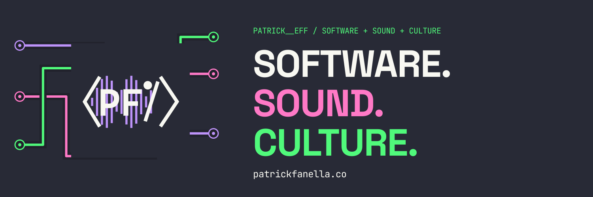

# Patrick Fanella / Patrick__eff

Senior full-stack and backend engineer based in Chicago. I build SUBCULT, software for independent culture, and tools for music and everyday workflows.

**Open to senior full-stack, backend and product engineering roles.** [Portfolio](https://patrickfanella.co) · [Resume](https://patrickfanella.co/resume) · [LinkedIn](https://www.linkedin.com/in/patrick-fanella/) · [Email](mailto:patrick@subcult.tv)

At DeliverZero, I built inventory, returns, and partner-integration workflows across three markets, reducing manual operational work by approximately 25%. My independent work spans deployed Go and Python services, PostgreSQL and search, GPU-backed media pipelines, privacy-aware social products, self-hosted automation, and interactive 3D visualization.

### Featured work

- [clpr](https://github.com/PatrickFanella/clpr) — Deployed Twitch discovery platform with a Go API, React client, PostgreSQL, hybrid search, queue-backed processing, moderation, and audit controls.
- [HasanAra](https://github.com/PatrickFanella/hasanara) — Citation-first video research platform with FastAPI, React, GPU-backed transcription, durable ingestion, PostgreSQL, and OpenSearch.
- [Patchwork](https://github.com/PatrickFanella/patchwork) — Pre-alpha AT Protocol demonstration of local requests, offers and coordination, with geospatial discovery, indexing, moderation and accessible interfaces.

### Selected engineering work

My public repositories cover product interfaces, backend services, search, media processing, and research data. These copies preserve project history; development, issues, and CI live on [Subcult Gitea](https://git.subcult.tv/subculture-collective).

| Project | Problem and implementation | Scope and technical reading |
| --- | --- | --- |
| [Left Field](https://github.com/PatrickFanella/left-field) | Seat-level election research that keeps public records, source provenance, provisional scores, and missing evidence separate. | Active development; scores are research notes, not forecasts. [Architecture](https://github.com/PatrickFanella/left-field/blob/main/ARCHITECTURE.md) · [Development and fixtures](https://github.com/PatrickFanella/left-field/blob/main/DEVELOPMENT.md) |
| [Rekolekt](https://github.com/PatrickFanella/rekolekt) | Self-hosted recording archives with timestamped transcripts, text search, and passage links back to source video. HasanAra is a deployment of the shared core. | Machine transcripts require checking against the recording. [Branding and deployment](https://github.com/PatrickFanella/rekolekt/blob/main/docs/deployment/client-branding.md) · [Development](https://github.com/PatrickFanella/rekolekt/blob/main/DEVELOPMENT.md) |
| [Undertow](https://github.com/PatrickFanella/undertow) | A browser editor combining audio visualization, artwork, timed lyrics, and local video encoding through a shared preview/export renderer. | Local export depends on browser codecs and hardware. Cloud rendering is in testing; paid billing is off. [Rendering](https://github.com/PatrickFanella/undertow/blob/main/docs/rendering.md) · [Development](https://github.com/PatrickFanella/undertow/blob/main/DEVELOPMENT.md) |
| [Deadweb Relay](https://github.com/PatrickFanella/deadweb-relay) | A small Go website with HTML, text, JSON, feeds, public notes, and append-only storage. | An HTTP and discovery experiment with inspectable storage. [Implementation and protocol](https://github.com/PatrickFanella/deadweb-relay#useful-http-behavior) · [Live site](https://www2.onnwee.me/) |

Product screenshots

**clpr — clip discovery**

**Undertow — layered music editor**

**HasanAra — a Rekolekt archive**

### More selected work

- [Clustr](https://github.com/PatrickFanella/clustr) — Community-graph infrastructure with interactive 2D/3D visualization and a Unity exploration client.
- [Subcult OS](https://github.com/PatrickFanella/subcult-os) — Event operations software in development for planning, staffing, free reservations, door check-in and reporting.

### Developer tooling

I also build tools for development, music and everyday workflows:

- [Obsidian Metronome + Tuner](https://git.subcult.tv/PatrickFanella/obsidian-plugin-metronome-tuner) — timing and chromatic tuning inside Obsidian.
- [Omarchy Monitor Bar](https://git.subcult.tv/PatrickFanella/omarchy-monitor-bar) — separate bar layouts for connected monitors.
- [Shelfish](https://git.subcult.tv/PatrickFanella/omarchy-plugin-shelfish) — collapsible groups of bar widgets.
- [Super Productivity bar integration](https://git.subcult.tv/PatrickFanella/omarchy-superproductivity) and [MCP integration](https://git.subcult.tv/PatrickFanella/super-productivity-mcp).

**Core stack:** Go · Python · TypeScript · React · PostgreSQL · PostGIS · OpenSearch · Docker · Kubernetes

**Seeking:** Senior Full-Stack Engineer · Backend Engineer · Product Engineer

📍 Chicago, IL · [Portfolio](https://patrickfanella.co) · [LinkedIn](https://www.linkedin.com/in/patrick-fanella/) · [Email](mailto:patrick@subcult.tv)
